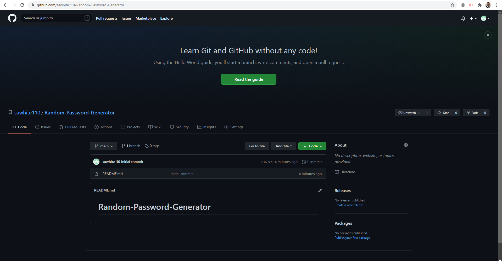
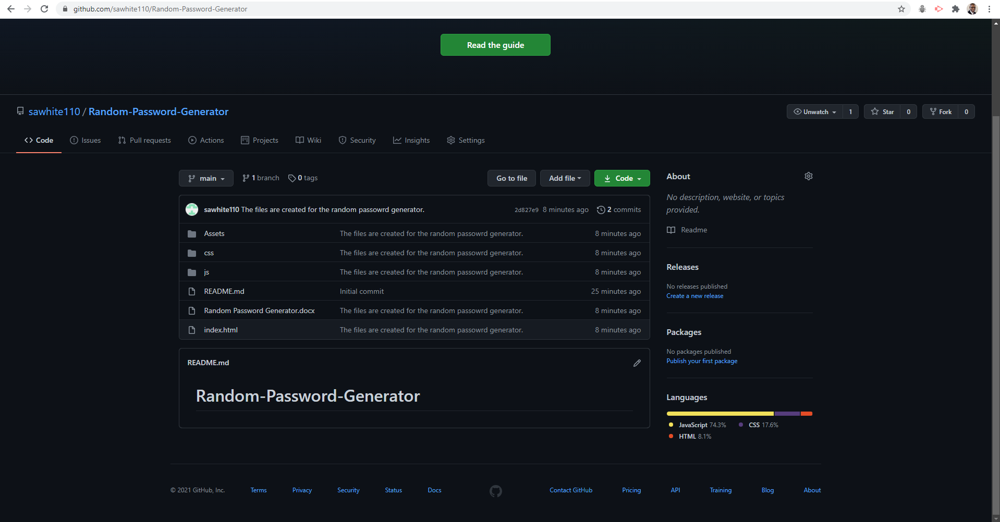

# Random Password Generator

---

* The purpose of this repository is to create a random password generator that will allow employees to create their own unique password, to protect access to sensitive data. It will meet certain password length criteria, so that the employee can create a strong password that provides greater security.

* The employee must choose a password that will be in the range of 8 to 128 characters long. This will include special characters, numeric characters, lowercase characters, and uppercase characters.

* When asked, the employee will choose to confirm or omit the characters of their choice.

* The random password generator will validate the choice entered and return a random password in the length and character selection, chosen by the employee. This password will be displayed onto the page for the employee to use.

---

## Screenshots

* This is a Mock-Up of the Password Generator.

* This is a screenshot of the created GitHub Repository.

* This is a screenshot of my updated github with the files updated.

---

* The readme.md, index.html, style.css, & script.js files are up to date and have been uploaded to GitGub.com, where they will be hosted and available on the web.